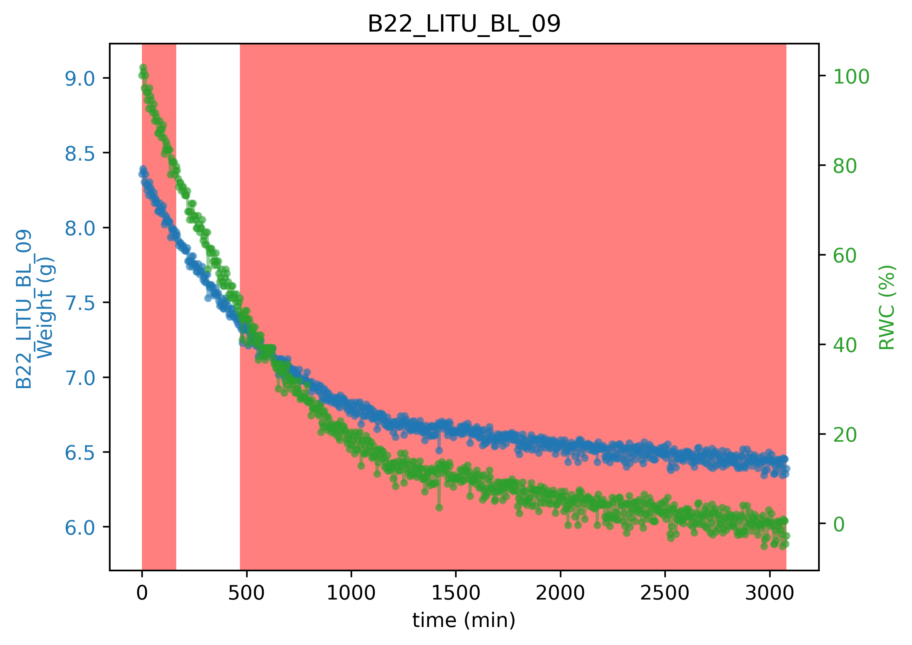
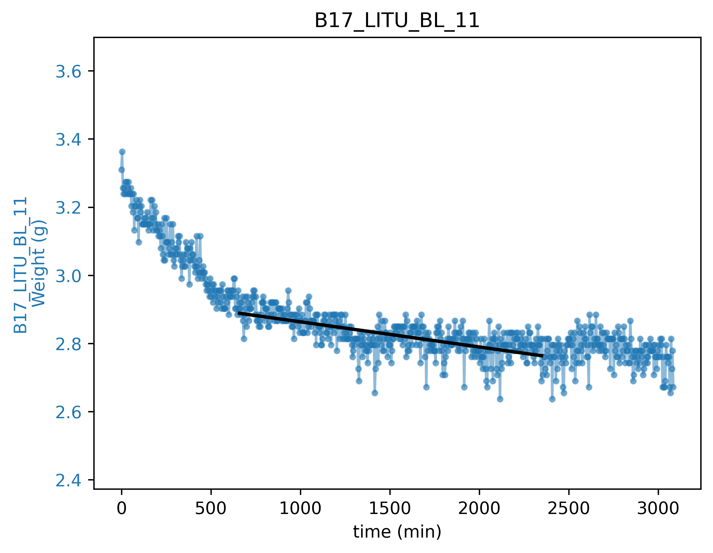
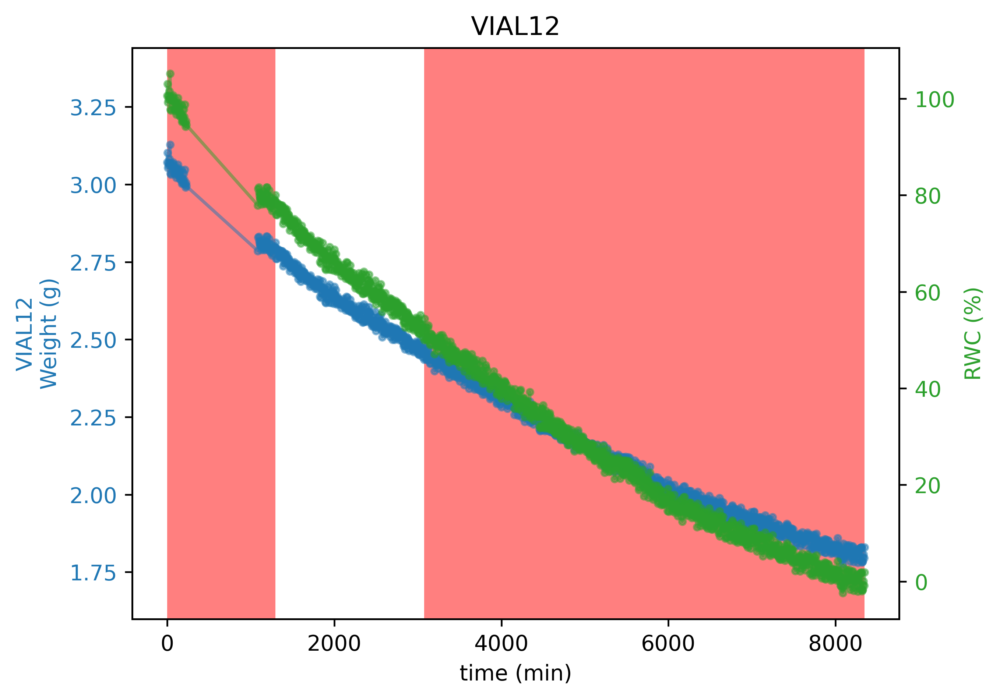

# gminComputation : a Python Program for estimating leaf conductance

Current version is: **2.0**

## Highlights 

Improvement of gmin estimation:
- VPD can be corrected

- Leaf shrinkage can be corrected

Program flow:
- Work directly frow raw files
- A batch mode is implemented
- A Conf file is used and can modfied

   

## Using this new version of gmin

### Work directly from raw files

You can directly use the files from the climatic chambers. The following columns are mandatory:

- date_time 
- Campaign
- Comment
- Temperature
- Relative Humidity
- Weight measured

you can see an example in the folder [input files](https://github.com/xbouteiller/gmin/tree/main/input_files)

Names can be user defined (see the conf file section), if several sensors are used for measuring temperature or RH, mean value will be computed.

### A metadata file is mandatory

It must necessarly contains the following columns:

- sample_ID :
- position 
- Area_m2 
- Patm 

Following columns must be in metadatafile but can be empty. If empty a default behaviour is adopted.

- Fresh_weight 
- Dry_weight 
- rwc_sup
- rwc_inf
- a, b, c, d, e
- eps, p0
- TLP

you can see an example in the folder [input files](https://github.com/xbouteiller/gmin/tree/main/input_files)

Note that if you name your file : **metadata.csv**, it can be included in the data folder

### A conf file is needed

A file named conf.cfg is expected in the program folder. It can be modified by the user.

-**config** section is mandatory
-**optional** section contains info for executing the program without prompting the menu, **use_opt** should be turned to True is you want to use
-**batch** parameters for the batch mode

Future version will allow the user to place its own conf file with the data

   

## How to install?

### Install Python version if needed

[Miniconda](https://docs.conda.io/en/latest/miniconda.html)

### Download full folder from git

1. Direct download

From the green box  named 'clone' in the right corner > download .zip

2. From the terminal

>
> git clone https://github.com/xbouteiller/gmin.git
>

### Install dependencies

>
> pip install -r requirements.txt 
>

### Install package

Open a terminal in the DetectEvent folder, then :

>
> python setup.py install
>

### Program Execution

In a terminal 

>
> python gminExec.py
>

### Installing updates

>
> git pull origin main
>
> python setup.py install
>

   

## Program flow

#### Step 1
1. The program ask to chose:
    - A folder that will be parsed for the data files
    - A metatadata file

The program writes the number of files found

#### Step 2
2. You have to chose which method you will use:
    - Select time interval manually then compute gmin in the interval time
    - Filtering the data based on RWC and then compute gmin in the interval time
    - Batch mode

#### Step 3 - Option 1
3. If you chose the manual points selection:
    - You have to select two points on the curve
    - Gmin is computed based on a linear regression between these two points

#### Step 3 - Option 2
4. If you chose the method based on RWC:
    - the semi auto method will plot curve each time
    - the full auto will precede to the gmin computation automatically

#### Step 3 - Option 3
4. If you chose the batch method:
    - A sliding RWC window is used to filter the files. Except that it is similar to the RWC method
    - Generated files are agregated within the same csv file

5. The data are first filtered based on RWC:

Default values for the RWC filtering are 80% and 50%, but this can be changed manually:
>
> python gminExec.py --rwc_sup 90 --rwc_inf 20 # Superior threshold : 90%, inferior : 20%  
> 

or in the metadata file for each sample.

6. If the columns Dry_weight and Fresh_weight are provided, he software use the provided values to compute RWC 

7. **New** if values are provided in the column a, b, c, d, e the leaf shrinkage is corrected using the formula:

8. **New** if values are provided in the column eps, p0 the vpd is corrected using the formula:

9. Gmin is computed based on a linear regression between the two boundaries of the RWC filtered data

#### Step 5
10. Synthetic figures and data frames are saved within the output_fig and output_files folder or batch folder if batch mode was used

   

## Data format

Data must be stored within files
For a better files recognition, first row of the csv file should contain the string "conductance" otherwise all csv from a folder will be parsed

Columns should be named as follows:

#### Quantitative columns

- date_time : time **(default is dd/mm/yyyy H:M)**
- Campaign: campaign name
- Comment
- T_C : temperature (°C)
- RH : Relative Humidity
- Weight measured : 1 column for each sample, the column header should match with the position in the metadata file.

#### Qualitative columns

- sample_ID : ID of the sample, should be **unique** for each sample
- position : the **unique** position in the climatic chamber, it should match the sample column header in the datafile
- Area_m2 : area of the leaf (m2)
- Patm : atmospheric pressure (KPa)

Following columns must be in metadatafile but can be empty, if empty a default behaviour is adopted
- Fresh_weight : fresh (saturated) weight of the leaf (g)
- Dry_weight : dry weight of the leaf (g)
- rwc_sup: superior threshold for filtering rwc
- rwc_inf: inferior threshold for filtering rwc
- a, b, c, d, e: parameters for computing leaf shrinkage
- eps, p0: parameters for correcting VPD
- TLP

#### Date

- date_time : time **(best with the format YEAR/MONTH/DAY HOUR:MINUTE )**

   

